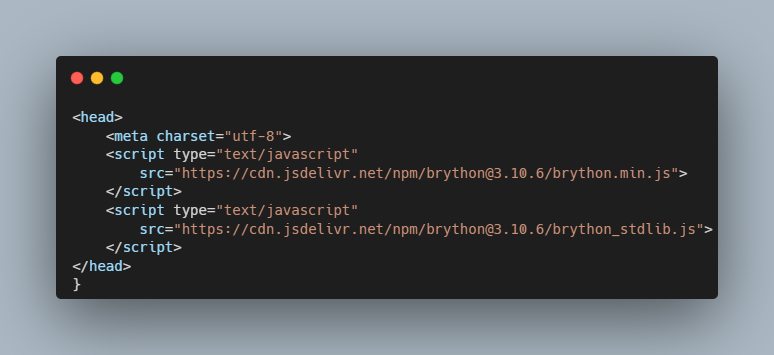
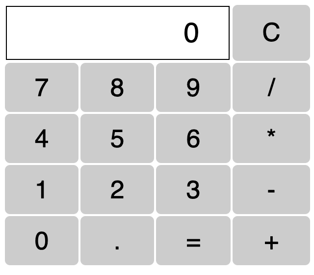

# Simple Python Calculator App in Browser using HTML

In this project, I used python and HTML using Brython compiler to develop a simple calculator app instead of javascript. 

---

In the header of the html document, I loaded the brython.js script which is the Brython engine that will execute the Python code included in the document. 


---
In the body, the attribute __onload="brython()"__ calls the **brython()** function which executes the python code. 

The line **from browser import document** imports the module browser which references the contents of the document displayed in the browser window.

The calculator displayed on the browser is: 


The buttons are (td) tags and are referenced by the line:
```python
document.select("td")
```
When the user clicks a button, the event "click" is triggered by the program executing the calculator programs
```python
for button in document.select("td"):
    button.bind("click", action)
```
The link to the app is attached below

[Click here]( https://calculatorappbrython.netlify.app "Calculator")